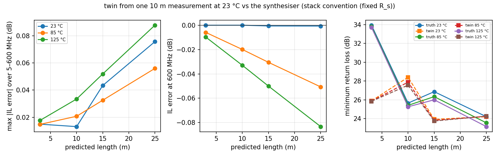
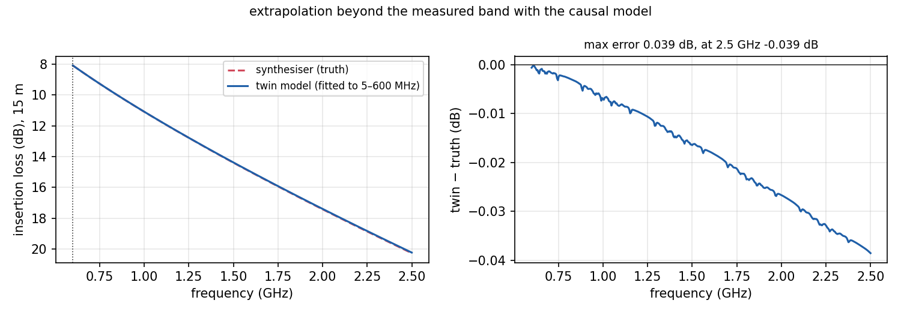
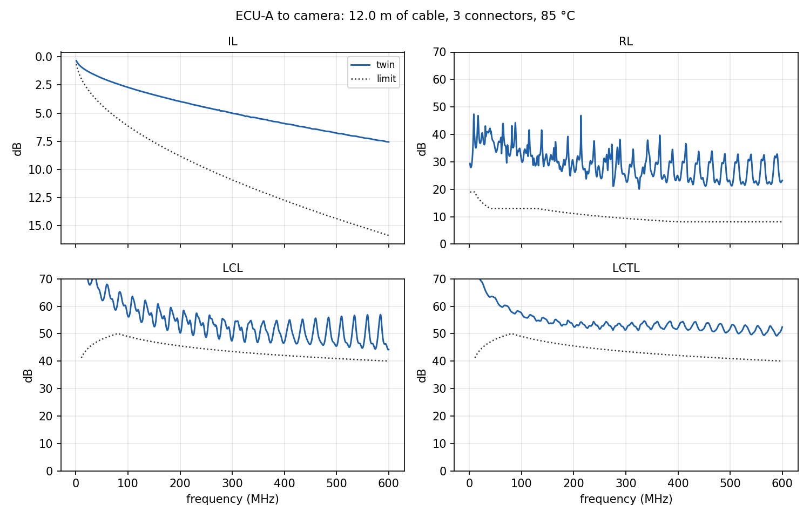
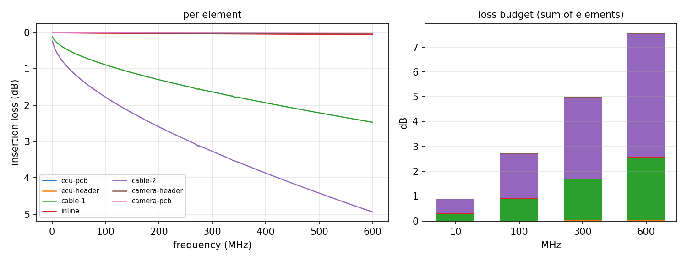
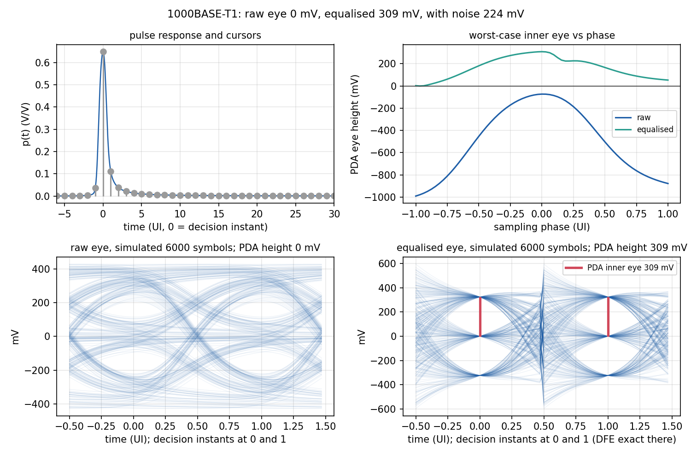
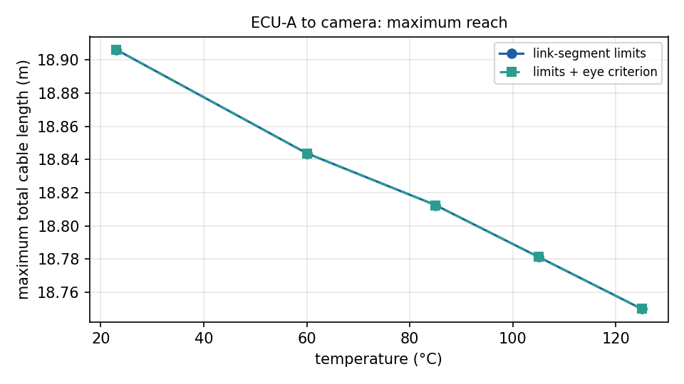
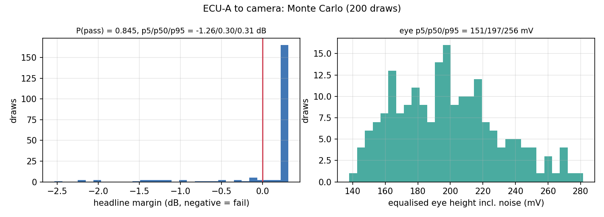
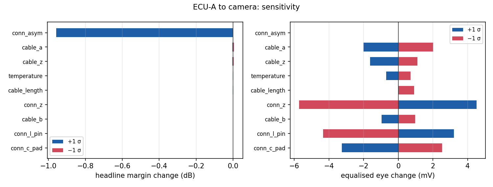
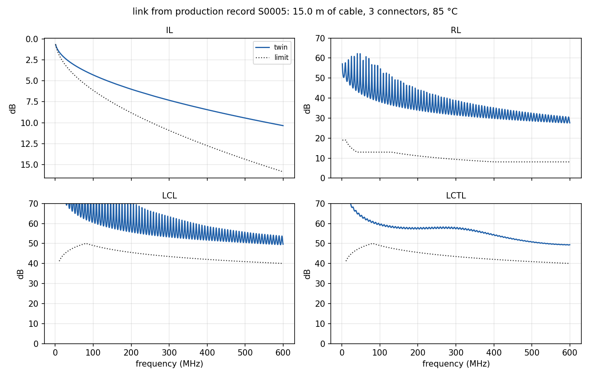
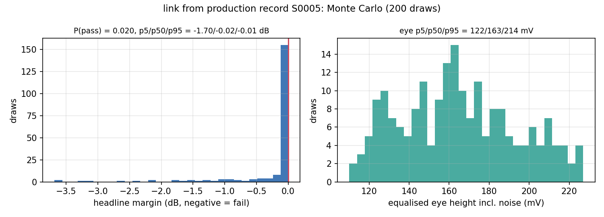

# What the twin is for

A harness engineer is asked, months before the first sample exists, whether a camera link of 4 m plus 8 m of a given cable with one inline connector will pass the 1000BASE-T1 link-segment requirements at 85 °C, what happens at 125 °C, how far the link could be stretched, whether a second inline connector is affordable, and which of the numbers on the cable data sheet the answer hinges on. The pieces of the answer exist in the earlier projects: project A turns S-parameters into quantities and verdicts against the standards' limit files [@ieee8023bp; @oa_tc9]; project B produces validated, archived measurements of cable samples; project F tells how much such a measurement can be trusted; project E predicts the loss coefficients and impedance of a cable from its extrusion-line record. What is missing is the *composition*: a measured 10 m sample is not the 4 m piece in the car, the sample was measured at 23 °C, the connectors are not in the sample, and the receiver does not see S-parameters but a pulse.

`linktwin` is that composition. It is deliberately not a field solver and not a circuit simulator: it takes what the laboratory measures or predicts, turns it into per-metre physics that can be re-scaled, adds compact models of what the laboratory does not measure (connectors, PCB traces, the PHYs' return loss), and computes the two things that decide a link — the link-segment quantities against their limits, and the eye at the slicer — with their uncertainty. It runs in seconds on a laptop, so it can be asked the inverse questions by iteration.

Everything in this report is synthetic. Cables come from project A's synthesiser (a segmented RLGC model with impedance ripple and roughness) passed through the VNA-noise model of the same project; the archive example comes from project B's simulated laboratory; the production example from project E's data set. The point is the machinery and its validation against ground truth that the twin never sees; the same machinery reads real Touchstone files, real `labauto` archives and real production records.

# Transmission-line algebra

## Chain matrices of one mode

A uniform line of one mode with propagation constant $\gamma(f)$ (Np/m and rad/m) and characteristic impedance $Z_c(f)$, of length $L$, has the chain (ABCD) matrix [@pozar2012]

$$\begin{bmatrix} V_1 \\ I_1 \end{bmatrix} = \begin{bmatrix} \cosh\gamma L & Z_c \sinh\gamma L \\ \sinh(\gamma L)/Z_c & \cosh\gamma L \end{bmatrix} \begin{bmatrix} V_2 \\ -I_2 \end{bmatrix},$$

with $I_2$ flowing into port 2. The conversion between ABCD and the two-port scattering matrix in a real reference $Z_0$ follows Frickey [@frickey1994], and the four-port single-ended S-matrix of a pair is decomposed into differential and common modes with Bockelman and Eisenstadt's transformation [@bockelman1995]; the differential mode is referred to $Z_{0,d} = 2 Z_0 = 100\ \Omega$ and the common mode to $Z_{0,c} = Z_0/2 = 25\ \Omega$. Both conversions are those of project A's `cablecheck` and are re-used unchanged.

## Extracting a line from a measurement

For a measured uniform line of known physical length $L_0$, the inverse problem has a closed form [@eisenstadt1992]: from the symmetrised chain matrix ($A$ and $D$ averaged, since a uniform line has $A = D$),

$$\gamma L_0 = \operatorname{arccosh} A, \qquad Z_c = \sqrt{B/C}.$$

The real part of $\operatorname{arccosh}$ is taken positive (attenuation), and $Z_c$ is taken in the right half plane. The imaginary part is the electrical length, which the principal branch returns in $[0, \pi]$ while the true value is $\pm\operatorname{Im}(\operatorname{arccosh} A) + 2\pi k$ with $k$ in the hundreds at 600 MHz for a 10 m cable. The branch and the sign are chosen by *continuity along frequency*: the first frequency point takes the candidate nearest to the velocity guess $2\pi f L_0/(v_{\text{guess}})$ with $v_{\text{guess}} = \mathrm{NVP}_{\text{guess}}\, c$; every following point takes the candidate nearest to the previous value plus the guessed increment. This is robust where a per-point nearest-to-guess rule is not: the skin-effect phase term (§3) makes the true $\beta L$ lag the guess by up to half a radian at 600 MHz, enough to pick the wrong sign wherever the principal value is near 0 or $\pi$; the increment between adjacent grid points is guessed to a small fraction of a radian, so the continuity rule never fails. A round-trip test (build a line from the model, extract it back) reproduces $\gamma$ to $10^{-6}$ relative.

The extraction is done separately for the differential and the common mode of the measured four-port, giving $\gamma_d, Z_{c,d}$ and $\gamma_c, Z_{c,c}$ per metre.

## Two-conductor lines in closed form

Connectors and headers are modelled as short two-conductor lines with per-unit-length matrices $\mathbf R, \mathbf L, \mathbf G, \mathbf C$ (each $2 \times 2$) [@paul2008]. With $\mathbf Z = \mathbf R + j\omega \mathbf L$ and $\mathbf Y = \mathbf G + j\omega \mathbf C$ the telegrapher equations $\mathrm d[\mathbf V; \mathbf I]/\mathrm dx = -[[0, \mathbf Z],[\mathbf Y, 0]]\,[\mathbf V; \mathbf I]$ give the chain matrix of a segment of length $l$ as $\exp(+\mathbf M l)$ with $\mathbf M = [[0, \mathbf Z],[\mathbf Y, 0]]$, in the convention $[\mathbf V(0); \mathbf I(0)] = \Phi\,[\mathbf V(l); \mathbf I(l)]$ that project A's four-port boundary solver expects. Instead of a general matrix exponential per frequency [@moler2003], the block structure is used: with $\mathbf P = \mathbf Z \mathbf Y = \mathbf V \operatorname{diag}(\lambda_i) \mathbf V^{-1}$ and $\gamma_i = \sqrt{\lambda_i}$,

$$\Phi = \begin{bmatrix} \cosh(\sqrt{\mathbf P}\, l) & \sqrt{\mathbf P}^{-1}\sinh(\sqrt{\mathbf P}\, l)\,\mathbf Z \\ \mathbf Y \sqrt{\mathbf P}^{-1}\sinh(\sqrt{\mathbf P}\, l) & \mathbf Y \cosh(\sqrt{\mathbf P}\, l)\, \mathbf Y^{-1} \end{bmatrix}, \qquad f(\sqrt{\mathbf P}) = \mathbf V \operatorname{diag} f(\gamma_i)\, \mathbf V^{-1},$$

which is batched over the frequency grid with numpy's eigen-solver and agrees with `scipy.linalg.expm` to $10^{-15}$ while being two orders of magnitude faster — the difference between a Monte-Carlo run of minutes and of hours.

# The cable model

## A causal per-metre model

The extracted $\gamma(f)$ carries the cable's physics plus the measurement's noise, and it exists only inside the measured band. The pulse response of a 1000BASE-T1 link needs the channel out to several GHz (the transmitter's edges), and the Monte Carlo needs a handful of parameters to perturb. Both call for a parametric model, and the model must be *causal*: an attenuation law without its matching phase produces a pulse that arrives before it is sent [@djordjevic2001; @johnson2003].

Per metre, with $f$ in Hz,

$$\alpha(f) = \frac{c_0 + a\sqrt f + b f}{8.686}\ \text{Np/m}, \qquad \beta(f) = \frac{2\pi f}{v} + \frac{a\sqrt f}{8.686}\ \text{rad/m}, \qquad Z_c(f) = Z_\infty\left(1 + \frac{(1 - j)\,k_z}{\sqrt f}\right).$$

The three loss terms are the DC-resistance floor, the skin-effect conductor loss and the dielectric loss — project E's physical basis, which that project showed to be necessary because a two-term fit pushes conductor loss into $b$, which then scales wrongly with temperature. The phase term $a\sqrt f/8.686$ is the causal companion of the skin-effect loss: the internal impedance of a conductor in the skin-effect regime is $(1 + j) R_s \sqrt f$ per unit length [@wheeler1942; @arabi1991], so the internal inductance contributes to $\beta$ exactly what the resistance contributes to $\alpha$, $\beta_{\text{skin}} = \alpha_{\text{skin}}$; the pair $(1 + j)\sqrt{\omega}$ is a Hilbert pair and the model is minimum-phase. The dielectric loss's phase companion is a slow logarithmic variation of the permittivity [@djordjevic2001] which, over a decade of band, is indistinguishable from a small change of $v$ and is folded into the fitted velocity. The same $(1 - j)/\sqrt f$ structure gives the skin-effect rise of $|Z_c|$ towards low frequency.

The fit is linear: non-negative least squares of $8.686\,\operatorname{Re}\gamma$ on the basis $[1, \sqrt f, f]$ above 5 MHz (the non-negativity keeps each term physical), then $v$ from the slope of $\operatorname{Im}\gamma - a\sqrt f/8.686$ against $2\pi f$, then $Z_\infty, k_z$ from a least-squares fit of $\operatorname{Re} Z_c$ on $[1, 1/\sqrt f]$. For the synthesiser's cable measured at 10 m with $-85$ dB noise the differential fit gives $c_0 = 0.0086$ dB/m, $a = 1.665\times10^{-5}$ dB/(m$\sqrt{\text{Hz}}$), $b = 1.98\times10^{-10}$ dB/(m Hz), NVP $= 0.682$, $Z_\infty = 99.5\ \Omega$, with an RMS residual of $3\times10^{-4}$ dB/m.

## Hybrid: the measured structure rides on the model

A real cable is not uniform: impedance ripple from the stranding lay and random roughness of the insulation set its return loss, and none of that is in three loss coefficients. The twin keeps it. At the fit, the residuals $\Delta\gamma(f) = \gamma_{\text{extracted}} - \gamma_{\text{model}}$ and $\Delta Z_c(f)$ on the measured grid are stored with the model; when the segment is evaluated, the model at the requested temperature is computed first and the residuals are added inside the measured band, tapered to zero over the last 3 % of the band so that the extrapolation beyond it is continuous. Because the residual is stored rather than the raw extraction, a later change of the coefficients — temperature, a Monte-Carlo draw — moves the whole curve and the measured structure rides on top of it.

The two residuals play different roles. $\Delta Z_c$ *is* the impedance structure and is always used. $\Delta\gamma$ makes the frequency-domain twin exact at the measured length (the pair $(\gamma, Z_c)$ reproduces the measured two-port identically) but it is, in equal parts, measurement noise: white in frequency, it spreads over the whole pulse response as a low-level non-causal floor, and a worst-case eye analysis, which sums the magnitudes of hundreds of cursors, turns $-85$ dB of noise into 25 mV of fictitious inter-symbol interference. The time-domain engine therefore evaluates the link with the $\gamma$ residual switched off (`Link.transfer(..., causal=True)`): the causal fitted propagation plus the measured impedance structure. The frequency-domain verdict uses both.

## Length and temperature

The point of the per-metre description is that a segment of any length $L$ is $\gamma(f) L$ with the same $Z_c(f)$, and the four-port of the piece is rebuilt from the two modal two-ports. Mode conversion of the cable itself — small for a good pair, but not zero — is carried as a per-metre conversion coefficient taken from the measured $S_{dc21}$ at 100 MHz, grown linearly with length and as $\sqrt f$ in frequency, with the phase of the differential transmission, placed symmetrically and reciprocally in the four-port.

Temperature enters through the material coefficients of projects E and F [@haynes2016; @iec60287]:

$$c_0(T) = c_0\,(1 + \alpha_\rho \Delta T), \quad a(T) = a\sqrt{1 + \alpha_\rho \Delta T}, \quad b(T) = b\,(1 + \beta_d \Delta T), \quad Z(T) = Z\,(1 - \gamma_Z \Delta T),$$

with $\alpha_\rho = 0.00393$/K for copper, $\beta_d = 0.004$/K for the dielectric loss tangent, $\gamma_Z = 6\times10^{-5}$/K, and $\Delta T = T - 20$ °C. The square root on $a$ is the physics of the skin effect: $R_s = \sqrt{\pi f \mu_0 \rho}/(\pi d)$ scales with $\sqrt{\rho(T)}$, and project E's design physics uses the same law. The synthetic instrument stack of projects A and B does *not*: its synthesiser computes $R_s$ from the 20 °C resistivity and moves only $R_{dc}$ and $\tan\delta$ with temperature, a simplification that project E's derating analysis inherited. The twin has a switch, `skin_temperature`, that reproduces that convention, and the validation (§8) runs against both truths; a model built from a measurement taken at $T_0 \neq 20$ °C is first referred to 20 °C by dividing by the same factors.

## A cable that does not exist yet

`CableSegment.from_coefficients(a, b, \mathrm{NVP}, Z, L)` builds a segment without any measurement, with no residual structure (its return loss is the smooth $Z_c$ against the reference and the mismatch at its ends). This is how project E's prediction enters: for a production record, `cableanalytics` fits its manufacturing-to-physics correlation on the data set and predicts $a$, $b$ and $Z$ with 90 % prediction intervals; the twin takes the predicted values as the segment, and turns the half-widths of the intervals into the relative standard uncertainties of $a$ and $b$ for the Monte Carlo ($u = (\text{hi}_{90} - \text{lo}_{90})/(2 \cdot 1.645\, x)$). What the correlation does not predict comes from project E's design physics: the velocity from the effective permittivity of the (foamed) insulation, and the DC floor $c_0 = 8.686\, R_{dc}/Z_d$ from the conductor diameter and alloy resistivity.

# Connectors and PCB traces

An inline connector or a header is modelled as a short two-conductor line of length $l$ (25 mm default) with differential impedance $Z_d$ (90 $\Omega$ default, 88 $\Omega$ for the inline connector of the examples), common-mode impedance $Z_{cm}$ (0.35 $Z_d$), velocity $v = \mathrm{NVP}\,c$, per-conductor series resistance $R' = R_{\text{contact}}/l + 2\alpha_{1\,\text{GHz}} (Z_d/2) \sqrt{f/1\,\text{GHz}}$ (contact resistance plus a skin-effect loss stated as dB/m at 1 GHz), and a capacitive asymmetry $\epsilon$ between the two contacts. The per-unit-length matrices follow from the odd- and even-mode impedances and velocities,

$$\mathbf L = \begin{bmatrix} L_s & M \\ M & L_s \end{bmatrix},\quad \mathbf C = \begin{bmatrix} C_s (1 + \epsilon) & -C_m \\ -C_m & C_s (1 - \epsilon) \end{bmatrix},\quad L_s = \tfrac12(L_o + L_e),\ M = \tfrac12(L_e - L_o),\ C_s = \tfrac12(C_o + C_e),\ C_m = \tfrac12(C_o - C_e),$$

with $L_o = Z_o/v$, $C_o = 1/(Z_o v)$ for the odd mode ($Z_o = Z_d/2$) and likewise for the even mode ($Z_e = 2 Z_{cm}$). The asymmetry $\epsilon$ is the source of mode conversion: it makes the two conductors' capacitances to the reference unequal, so a differential wave excites a common-mode wave along the segment. At both interfaces a lumped pin inductance (1 nH per contact, series) and pad capacitance (0.3 pF per contact, shunt) are added as $4\times4$ ABCD blocks, the whole chain is solved to S by project A's boundary solver, and the three S-matrices (parasitics, line, parasitics) are cascaded. A connector with $\epsilon = 0.01$ has LCL $\approx 52$ dB over the band; $\epsilon = 0.02$ gives 46 dB, which is where the 1000BASE-T1 LCL limit ($72 - 11.51\log_{10} f_{\text{MHz}}$) starts to bite at 600 MHz. A PCB trace is a `CableSegment` from coefficients ($Z_d = 95\ \Omega$, NVP 0.55, $a = 3\times10^{-6}$, $b = 8\times10^{-11}$ by default).

These are compact models with declared parameters, not measurements of any product; a measured connector four-port can be inserted as an element in the same way as a cable (the element interface is only `sparams(f)`), and the Monte Carlo treats the connector parameters as uncertain.

# The link

## Cascade

The link is the ordered list of elements from the transmitter to the receiver. Each element's four-port is converted to a block wave-chain (T) matrix with the near pair as the left group and the far pair as the right group, the T-matrices are multiplied, and the product is converted back to S — project A's `cascade`, which handles $2n$-ports in general. Because all four ports are cascaded, a common-mode wave created by one connector's asymmetry propagates along the cable's common mode (with its own $\gamma_c$ and $Z_{c,c}$) and can be converted back by the next connector: the link's LCL and LCTL are not the sum of the elements' but their interference, which is why the mode-conversion margin of a link varies with cable length in a way no single element predicts (§7.1).

## The verdict

The cascaded four-port on the standard's grid (0.5–600 MHz for 1000BASE-T1, 1200 points) goes through project A's `compute_quantities` and `evaluate` with the link-segment cable type: insertion loss, return loss, LCL, LCTL, phase delay and (for multi-pair links) NEXT, each against its limit expression and frequency spans from the limit file, with the same worst-margin bookkeeping a measured harness gets. The bare-cable impedance-profile quantities of the limit set are not link-segment requirements and are left out. The result carries the verdict, the headline (worst-margin) quantity, its margin and its frequency, all rows, the insertion loss at 10/100/300/600 MHz, and the minimum return loss and LCL. Nothing about the evaluation is specific to the twin — a link that fails here would fail the same way if it were built and measured, up to the twin's own accuracy (§8).

## Transfer function with mismatched PHYs

The receiver does not see $S_{dd21}$; it sees the voltage that a source of impedance $Z_S$ delivers into a load $Z_L$ through the two-port. With the PHY reflection coefficients $\Gamma_S, \Gamma_L$ in the 100 $\Omega$ reference (a PHY with 20 dB return loss has $|\Gamma| = 0.1$), the differential voltage transfer, normalised so that it equals $S_{21}$ for matched PHYs, is

$$H(f) = \frac{S_{21}\,(1 + \Gamma_L)(1 - \Gamma_S)}{(1 - S_{11}\Gamma_S)(1 - S_{22}\Gamma_L) - S_{12} S_{21} \Gamma_S \Gamma_L},$$

the standard result of the signal-flow graph of a two-port between a mismatched source and load [@pozar2012; @kurokawa1965]. The denominator is the multiple-reflection series between the link's ends and the PHYs; its phase depends on the electrical length, so the worst case over PHY mismatch is not a fixed phase, and the Monte Carlo (§6) draws the phases of $\Gamma_S$ and $\Gamma_L$ uniformly at the stated magnitude.

# The eye at the receiver

## Pulse response

A transmitter that sends one PAM symbol as a rectangular pulse of one unit interval $\mathrm{UI} = 1/f_{\text{baud}}$ with Gaussian-shaped edges of 20–80 % rise time $t_r$ has the spectrum

$$P_{\text{tx}}(f) = \mathrm{UI}\operatorname{sinc}(f\,\mathrm{UI})\, e^{-j\pi f\,\mathrm{UI}} \exp\!\left(-\frac{f^2}{2\sigma_f^2}\right), \qquad \sigma_f = \frac{1.6832}{2\pi t_r},$$

since a Gaussian step of time-domain width $\sigma_t = 1/(2\pi\sigma_f)$ rises from 20 to 80 % in $2 \times 0.8416\,\sigma_t$. The received pulse per volt of transmitted level is $p(t) = \mathcal F^{-1}\{H(f) P_{\text{tx}}(f)\}$, evaluated by an inverse real FFT on a grid of 32 samples per UI over a record long enough for four cable delays plus 60 UI (at least 200 UI), which puts the highest frequency at $16 f_{\text{baud}}$ — 12 GHz for 1000BASE-T1. That is far beyond the measured band and is exactly what the causal model is for: beyond 600 MHz the cable is its fitted $\alpha, \beta$, the connectors their MTL model, and the transmitter's own edge filter removes what is left. The pulse is launched 4 UI after $t = 0$ so that its Gaussian leading edge does not wrap around the end of the record [@bracewell2000]. The PHY presets (Table 1) are representative values for the three automotive standards [@ieee8023bw; @ieee8023bp; @ieee8023ch], declared as such.

Table: PHY presets of the eye engine.

| preset | baud | levels | $V_{pp}$ | $t_r$ (20–80 %) | PHY RL | noise rms | DFE taps | FFE (pre, post) |
|---|---|---|---|---|---|---|---|---|
| 100BASE-T1 | 66.67 MBd | PAM3 | 2.0 V | 5 ns | 20 dB | 8 mV | 8 | (1, 2) |
| 1000BASE-T1 | 750 MBd | PAM3 | 1.0 V | 0.45 ns | 20 dB | 6 mV | 12 | (1, 3) |
| 2.5GBASE-T1 | 1406.25 MBd | PAM4 | 1.0 V | 0.25 ns | 20 dB | 4 mV | 16 | (2, 4) |

## Peak-distortion analysis

For PAM-$M$ with level spacing $\Delta = V_{pp}/(M - 1)$ and symbols $a_k \in \{-\tfrac{M-1}{2}, \dots, \tfrac{M-1}{2}\}\Delta$, the sample at the decision instant $t_0 + n\,\mathrm{UI}$ is $r_n = a_n p_0 + \sum_{k \neq 0} a_{n-k} p_k$ with the cursors $p_k = p(t_0 + k\,\mathrm{UI})$. The worst-case inner eye — the smallest gap between two adjacent levels over all symbol sequences — is

$$h_{\text{eye}}(t_0) = \Delta\left[p_0(t_0) - (M - 1)\sum_{k \neq 0} |p_k(t_0)|\right],$$

the peak-distortion bound [@casper2003; @proakis2008]: the eye height is its maximum over the sampling phase $t_0$ (searched over $\pm1$ UI around the pulse peak in steps of 1/32 UI), the eye width is the span of $t_0$ over which it is positive, and the closure is $1 - h_{\text{eye}}/(\Delta p_0)$. It is exact for independent symbols (the worst sequence exists and is realised, given enough symbols) and a bound for any sequence. The cursor window must contain every cursor that matters: the reflections between a link's connectors arrive two cable delays after the main cursor — 110 UI for a 15 m 1000BASE-T1 link — so the post-cursor window is set from the pulse itself, up to the last sample whose magnitude exceeds $10^{-4}$ of the peak, with 8 pre-cursors.

## Equalisation

The 1000BASE-T1 receiver is a decision-feedback equaliser; without it the raw eye of a 12 m link is closed (Figure 3). An ideal DFE of $N$ taps subtracts the first $N$ post-cursors exactly [@austin1967]: they are removed from the sum and their values recorded as the taps. A feed-forward equaliser of $(n_{\text{pre}}, n_{\text{post}})$ taps is the least-squares zero-forcing solution on the symbol-spaced cursors [@lucky1965]: with the convolution matrix $\mathbf A$ of the cursor sequence, the taps $\mathbf w$ minimise $\|\mathbf A \mathbf w - \mathbf e\|^2$ where $\mathbf e$ is the unit vector at the main cursor scaled to keep its amplitude, and the rows of the post-cursors that the DFE will cancel are dropped from the problem so that the FFE spends its degrees of freedom on the pre-cursors and the tail. The FFE is applied before the DFE. The equalised eye is the PDA of the residual cursors. Receiver and alien-crosstalk noise of rms $\sigma_n$ at the slicer reduces the height by $2 Q \sigma_n$ with $Q = 7.03$ for a bit-error ratio of $10^{-12}$ (the Gaussian tail $Q(7.03) = 10^{-12}$); the noise enhancement of the zero-forcing FFE and the error propagation of the DFE are not modelled and are declared in §9.

## Bit-level validation

A worst-case bound is only useful if it is tight. `simulate_eye` sends $N$ random PAM symbols (6000 by default) through the pulse response on the 32-samples-per-UI grid, applies the same FFE as a symbol-spaced filter on the waveform and the same DFE by subtracting $\sum_k d_k a_{n-k}$ around each decision instant with the known symbols (an ideal DFE, exact at the instant), samples at the PDA's decision instants (skipping the start-up symbols and the record ends), and reports the observed inner eye: for every pair of adjacent levels, the minimum of the upper level's samples minus the maximum of the lower level's. It must never be below the PDA bound and should be close to it. It is (§8.3): 421 vs 420 mV at 5 m, 362 vs 361 mV at 10 m, 311 vs 311 mV at 15 m equalised; for the raw eye the simulation sits 25–60 mV above the bound, as expected when the worst sequence of a hundred small cursors is rare in 6000 symbols.

# Questions a designer asks

## Inverse problems

*Maximum length.* All cable segments of the harness are scaled by a common factor (the connectors stay), the link is re-evaluated at the requested temperature, and the longest passing total cable length is found. Pass/fail is not monotonic in length: a very short link can fail mode conversion because the converted signal of the connectors is not attenuated, and the LCL of a link with several connectors oscillates with length as their contributions interfere. The range is therefore scanned in 1 m steps first and the bisection (to 5 cm) runs between the last passing and the next failing point; a low-length failure is reported alongside. With a PHY named, an equalised-eye criterion ($h_{\text{noise}} \geq h_{\min}$) is added to the pass condition.

*Connector budget.* The cable is cut into $n + 1$ equal pieces joined by $n$ copies of a stated inline connector (the harness's own inline connectors are replaced, its end connectors and PCBs kept), for $n = 0, 1, 2, \dots$; the largest passing $n$ is the budget and the table shows which quantity gives way.

*Limiting element.* Each element in turn is replaced by a through (a lossless, matched, symmetric four-port), and the gain of the headline margin is the ranking of what to fix first — with the caveat that removing a lossy element can *lower* a margin when it exposes a mode-conversion interference that the loss was hiding, which the table shows as a negative gain.

*Temperature ceiling.* Bisection on temperature from the harness's own temperature upwards, to 1 K.

## Uncertainty

Each Monte-Carlo draw [@gum_s1] perturbs a deep copy of the link from its stated standard uncertainties (Table 2): the cable's $a$ and $b$ (relative), $Z_d$ (absolute), every segment's length (cutting tolerance) and temperature (label uncertainty), and every connector's impedance, pin inductance, pad capacitance and contact asymmetry; the PHY return loss is held at its stated magnitude with uniformly random phases at both ends. The draw is re-evaluated for the link-segment verdict and for the equalised eye with noise. Reported: $P(\text{pass})$, the 5/50/95 percentiles of the headline margin and of the eye height, the pass probability per quantity, and the distribution of which quantity is the headline. The relative uncertainties of $a$ and $b$ default to 2 % and 5 % (the repeatability and calibration bounds of project F's budgets at 600 MHz); for a production-predicted cable they are replaced by the wider half-widths of project E's prediction intervals.

Table: default tolerances (1 $\sigma$) of the Monte Carlo.

| parameter | default | parameter | default |
|---|---|---|---|
| cable $a$ (relative) | 2 % | connector $Z_d$ | 5 $\Omega$ |
| cable $b$ (relative) | 5 % | connector pin $L$ (relative) | 30 % |
| cable $Z_d$ | 1 $\Omega$ | connector pad $C$ (relative) | 30 % |
| cable length (relative) | 0.5 % | connector asymmetry $\epsilon$ | 0.01 |
| temperature | 2 K | PHY return loss (magnitude, phase random) | 20 dB |

The one-at-a-time sensitivity moves each parameter by $\pm1\sigma$ with the rest nominal and records the change of the headline margin and of the equalised eye — a tornado [@saltelli2002], which is what the designer reads first: it says whether the answer hinges on the cable's data-sheet loss, on the connector's asymmetry, or on nothing in particular.

# Validation against ground truth

The twin's claims are checked against project A's synthesiser, which the twin never sees directly: it sees one noisy measurement of one 10 m piece at 23 °C (VNA noise floor $-85$ dB, seed 1), and the truth is the synthesiser run at other lengths and temperatures. The synthesiser is a 48-segment RLGC pair with impedance ripple (0.4 %) and roughness (0.3 %) [@paul2008; @iec61156]. All numbers below are produced by `linktwin validate` and reproduced in the tests.

## Length and temperature scaling

Table 3 gives, for the physical temperature law, the maximum insertion-loss error over 5–600 MHz, the error at 600 MHz against the truth's value there, the minimum return loss of truth and twin, and the maximum phase error. The insertion loss is predicted to better than 0.1 dB everywhere, including a factor 2.5 in length and 100 K in temperature beyond the measurement; the 600 MHz error at 125 °C is $-0.03$ to $-0.09$ dB, i.e. the twin is slightly *optimistic* at the hottest and longest corner (the synthesiser's proximity factor multiplies its whole conductor resistance, which the three-term basis attributes partly to $c_0$), which the Monte Carlo's temperature and $a$ tolerances cover. Under the stack's temperature convention (skin resistance fixed) with the twin told so, the errors are 0.013–0.088 dB. Both are in Figure 1.

Table: twin from one 10 m / 23 °C measurement against the synthesiser, physical temperature law.

| length | $T$ | max $|\Delta \mathrm{IL}|$ | $\Delta\mathrm{IL}$(600 MHz) | IL(600 MHz) truth | RL min truth / twin | max $\Delta\phi$ |
|---|---|---|---|---|---|---|
| 3 m | 23 °C | 0.015 dB | $-0.000$ dB | 1.62 dB | 33.9 / 25.9 dB | 1.5° |
| 3 m | 125 °C | 0.018 dB | $-0.010$ dB | 2.01 dB | 33.3 / 26.0 dB | 1.5° |
| 10 m | 23 °C | 0.013 dB | $+0.000$ dB | 5.39 dB | 25.7 / 28.4 dB | 5.4° |
| 10 m | 125 °C | 0.035 dB | $-0.034$ dB | 6.69 dB | 25.6 / 28.0 dB | 4.8° |
| 15 m | 23 °C | 0.043 dB | $-0.001$ dB | 8.09 dB | 26.8 / 24.0 dB | 7.7° |
| 15 m | 125 °C | 0.054 dB | $-0.052$ dB | 10.04 dB | 25.1 / 24.0 dB | 7.6° |
| 25 m | 23 °C | 0.075 dB | $-0.001$ dB | 13.48 dB | 24.2 / 24.2 dB | 12.1° |
| 25 m | 125 °C | 0.091 dB | $-0.087$ dB | 16.73 dB | 22.3 / 24.2 dB | 13.4° |

The return-loss columns show a limitation, not an error: the twin carries the impedance structure of the *measured* piece as a uniform-line $Z_c(f)$, and a 3 m or 25 m piece of the same cable is a different random realisation of the same ripple statistics. The twin's RL minimum is therefore a representative value (24–26 dB for this cable) rather than a prediction of the particular piece, and it is conservative for short pieces, whose true minimum is higher. Even at the measured length the twin's minimum differs from the measured one by about 3 dB (28.4 against 25.7 dB), because a non-uniform piece reflects differently from its two ends ($S_{11} \neq S_{22}$, here by 0.06 in magnitude) and the symmetrised extraction keeps the average. The phase error grows with length because the fitted velocity is a single number; 14° at 600 MHz over 25 m is 0.065 ns of 123 ns.

## Extrapolation beyond the band

The model fitted to 5–600 MHz, evaluated at 0.6–2.5 GHz for 15 m, differs from the synthesiser by at most 0.04 dB ($-0.04$ dB at 2.5 GHz, of 27 dB) under the physical law and 0.11 dB under the stack convention (Figure 2). The synthesiser's loss is exactly of the form the model assumes, so this is a test of the fit and of the causal phase, not of a real cable's high-frequency physics; on a real cable the dielectric term's dispersion and the stranding's resonances would set the limit, and the extrapolation should be trusted as far as the transmitter's edge filter needs it — for 1000BASE-T1, to about 1.5 GHz, where the Gaussian edge is already 20 dB down.

## Cascade and eye

A harness of PCB, header, 6 m, inline connector, 9 m, header, PCB is evaluated twice: with the twin's cable pieces (from the 10 m measurement) and with the synthesiser's true pieces at 6 and 9 m, with identical connector and PCB models. Both verdicts agree (PASS), the headline margin — insertion loss at the low-frequency end of the band — differs by 0.001 dB, the LCL margin by 0.005 dB, return loss by 0.013 dB, LCTL by 0.11 dB and phase delay by 0.007 ns of a 94 ns limit. The bit-level eye validation is in §5.4: 421 vs 420 mV at 5 m, 362 vs 361 mV at 10 m and 311 vs 311 mV at 15 m for the equalised eye (simulation vs PDA), 304 vs 280, 164 vs 107 and 50 vs 0 mV for the raw eye.

# Demonstration

`linktwin demo` writes the example measurement (the synthesiser's 10 m pair with VNA noise), four harnesses, and runs everything on them; the numbers below are from its record. The first harness, *ECU-A to camera*, is 60 mm of PCB, a header ($Z_d = 90\ \Omega$, $\epsilon = 0.01$), 4 m of cable, an inline connector ($88\ \Omega$, $\epsilon = 0.02$), 8 m of cable, a header and 40 mm of PCB, at 85 °C, judged against the 1000BASE-T1 link segment with a 1000BASE-T1 PHY.

## The camera link

The link passes at 85 °C with a headline margin of $+0.30$ dB — on insertion loss at 1 MHz, the low-frequency end of the band, where this cable's DC and skin-effect resistance meet a limit that is tight there (0.66 dB for the whole link) — and comfortably elsewhere: LCL $+3.8$ dB (at 324 MHz), LCTL $+6.7$ dB, return loss $+8.9$ dB, phase delay $+33.7$ ns (Figure 3, left). The insertion loss is 0.89 / 2.72 / 5.01 / 7.56 dB at 10 / 100 / 300 / 600 MHz, of which the two cable pieces are 7.1 dB at 600 MHz and the three connectors 0.12 dB (Figure 3, right). The raw eye is closed (the PDA bound is zero and even the 6000-symbol simulation shows only 80 mV): 1000BASE-T1 over 12 m does not work without its equaliser. With the FFE and DFE the worst-case eye is 309 mV — the simulation says 321 — and 224 mV after noise at $10^{-12}$; the main cursor is 0.65, the equalised closure 5 % (Figure 4).

The inverse questions: the longest total cable that still passes is 18.9 m at 23 °C and 18.8 m at 125 °C, limited by the 94 ns phase-delay limit rather than by loss — this cable has loss to spare, and the eye criterion of 100 mV never binds (Figure 5); the link passes up to the 150 °C search limit; it tolerates two inline connectors of the stated kind (LCL 42.2 dB at $n = 2$, 39.8 dB and a $-0.96$ dB fail at $n = 3$); and the limiting-element table says that removing cable-1 would gain 0.12 dB while removing cable-2 would *lose* 0.10 dB, because without the 8 m the connectors' mode conversion is no longer attenuated and LCL becomes the headline — the kind of counter-intuitive fact the twin exists to surface.

The Monte Carlo with the harness's tolerances (Table 2, temperature 3 K, connector asymmetry 0.01) gives $P(\text{pass}) = 0.85$ over 200 draws; the headline margin has percentiles $-1.26 / +0.30 / +0.31$ dB and the equalised eye with noise 151 / 197 / 256 mV. Insertion loss, LCTL, return loss and phase delay pass in every draw; the 15 % of failures are all LCL, and the tornado says why: a $+1\sigma$ contact asymmetry on every connector costs 0.96 dB of headline margin while every other parameter moves it by less than 0.01 dB, and for the eye the cable's $a$ ($\pm2$ mV), the connectors' impedance ($+4.5/-5.7$ mV) and pin inductance ($+3.2/-4.3$ mV) matter and nothing else does (Figure 6). The designer's conclusion is not "the link is marginal" but "the link is safe on loss and hinges on the connectors' balance": specify or measure the connector's asymmetry and the uncertainty collapses.

## The same harness from a data sheet

`coefficients-link.toml` describes the same harness with the cable given only as $a = 1.66\times10^{-5}$, $b = 2.0\times10^{-10}$, NVP 0.68, $Z = 100\ \Omega$ — no measurement, no structure. Its verdict is the same (PASS, $+0.42$ dB on insertion loss at 1 MHz; the data-sheet cable has no DC floor $c_0$, which is why it is 0.13 dB more optimistic at the low end), its eye 326 mV equalised (241 mV with noise), its reach 18.2 m, its connector budget 2, its $P(\text{pass})$ 0.81 with the same LCL mechanism. The return loss differs most (minimum 21.8 dB against 20.1 dB for the measured cable), because a data-sheet cable has no ripple: this is the honest statement of what a measurement adds to a data sheet — structure, not loss.

## A cable from the laboratory archive

`archive-link.toml` takes its 12 m trunk from a `labauto` job directory (project B): the sidecar supplies the measured length (15 m), the sample temperature (23 °C), the fixture method (none), the trust (`trusted`, verification `pass`), the calibration record (`CAL-20260916-SOLT4`), the site (LAB1), the procedure hash and the raw file's SHA-256, and the manifest is verified before the file is used (`archive_integrity: true`). All of it is carried in the harness's record, so a link verdict can be traced to the measurement it rests on in the way project F's trust cards trace a result. Evaluated at 105 °C the link passes ($+0.28$ dB), its eye is 318 mV equalised, its reach 19 m, and with the trunk's own tolerances $P(\text{pass}) = 0.98$.

## A cable that has not been made

`production-link.toml` is the point of the stack: 15 m of sample S0005 of project E's production data set — line L3, design D100-PP-022, CuSn0.3 conductor, polypropylene insulation — for which no measurement exists. `cableanalytics` predicts $a = 2.34\times10^{-5}$ [2.25, 2.43] dB/(m$\sqrt{\text{Hz}}$), $b = 2.77\times10^{-11}$ [2.55, 3.01] dB/(m Hz) and $Z = 100.7$ [100.0, 101.5] $\Omega$ (90 % intervals); the design physics adds NVP 0.767 (foamed PP) and $c_0 = 0.0149$ dB/m (the tin-bronze alloy's resistivity). The twin says: this link fails at 85 °C by 0.02 dB on insertion loss at 1 MHz (Figure 7), its maximum length is 14.5 m at 85 °C and 13.3 m at 125 °C (16.9 m at 23 °C), and with the prediction intervals as the cable's uncertainty $P(\text{pass}) = 0.02$ — the failure is not a coin toss but a property of the design: the higher-resistivity alloy costs 0.6 dB at the low-frequency end against the copper cable of the camera link. The equalised eye is fine (260 mV, 176 mV with noise): the link would *work*; it would not *comply*. That distinction, made before the cable is extruded, is what the seven projects together are for.

# Limitations, declared

*Synthetic throughout.* Cables, noise, archives and production records are the simulators of projects A, B and E. The twin's accuracy against a real cable is bounded by what those simulators leave out — stranding resonances, dielectric dispersion, the frequency dependence of the proximity effect — and by the measurement's fixture removal, which project A handles and the twin re-uses for archive sources.

*Piece-to-piece structure.* The impedance structure that sets return loss is that of the measured piece; another piece of the same cable has the same statistics and a different pattern (§8.1). The twin's return loss is representative, exact only at the measured length, and conservative for short pieces.

*Uniform-line extraction.* A non-uniform piece reflects differently from its two ends; the symmetrised extraction keeps the average (about 3 dB at the RL minimum here). A two-segment extraction from $S_{11}$ and $S_{22}$ separately would recover the asymmetry and is a natural extension.

*Connector and PHY models.* Compact models with declared parameters, not measurements; the Monte Carlo treats their parameters as uncertain, but a systematic error of the model (a resonance of a real connector, a PHY's actual return-loss phase) is not covered. Measured connector four-ports can be used as elements.

*Equalisation.* Ideal zero-forcing FFE and ideal DFE with correct decisions: no adaptation error, no noise enhancement of the FFE, no DFE error propagation, no timing jitter. The noise term is a single rms at the slicer. The eye is therefore an upper bound on what an implementation achieves, and the PDA is a lower bound on the eye for that ideal equaliser — the two bounds are stated separately.

*Single pair.* The link is one pair; alien and pair-to-pair crosstalk enter only as the noise rms. Project A's NEXT/FEXT evaluation is available for multi-pair elements but no multi-pair connector model is provided.

*Temperature.* Linear material coefficients with the values of projects E/F; the stack's own simplification of the skin-effect temperature dependence is handled by a switch, and a real cable's coefficients should come from project E's derating fit.

*Internal inductance.* The synthesiser's conductor model has a $\sqrt f$ resistance without the matching internal inductance, so its low-frequency phase delay lacks the $a/\sqrt f$ dispersion that causality requires and the twin's model has. Inside the measured band the twin's frequency-domain evaluation carries the measured phase (the $\gamma$ residual) and agrees with the synthesiser; in the time domain the twin is the more physical of the two, and the difference (about 3 ns at 2.5 MHz over 15 m, nothing above 100 MHz) is a statement about the synthesiser.

# Reproducibility

`pip install cablecheck…zip linktwin` (optionally `labauto`, `cableanalytics` for the archive and production sources); `linktwin demo OUT` reproduces every number and figure of §8–9 in about twenty minutes (`--quick` in a few); `linktwin validate` reproduces §8 alone; `pytest` runs 21 tests (line algebra round trips, causality, matched-line delay, self-reproduction, scaling under both temperature conventions, extrapolation, connector passivity/reciprocity/conversion, cascade consistency, verdict rows, twin-versus-truth harness, pulse causality and delay, PDA bound, eye monotonicity, inverse tools, Monte Carlo and sensitivity, harness loading and every CLI command). `docs/make_figures.py --reuse OUT` copies a demonstration's figures into the report and `docs/build.sh` builds it.

# References
